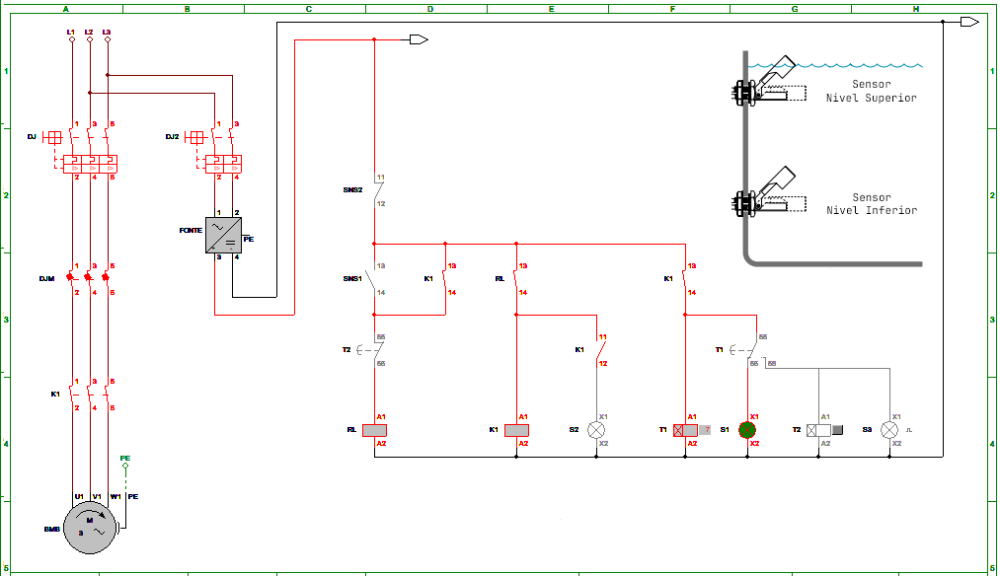
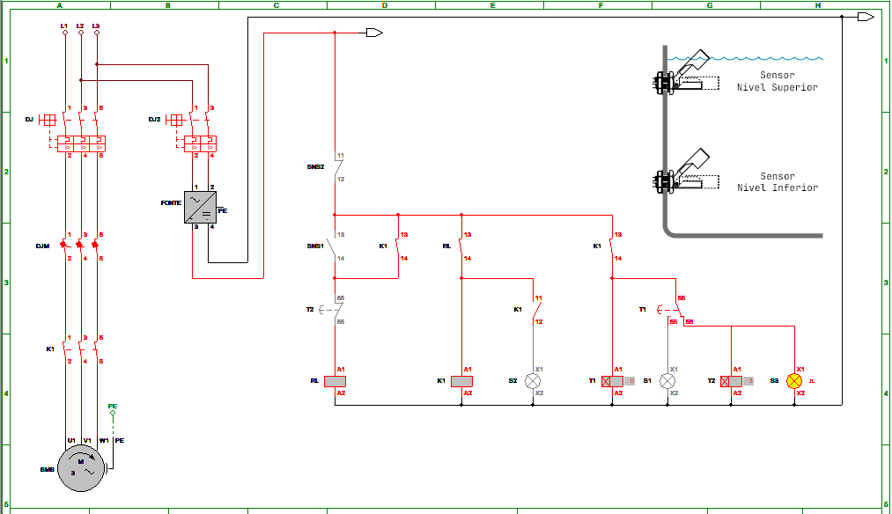
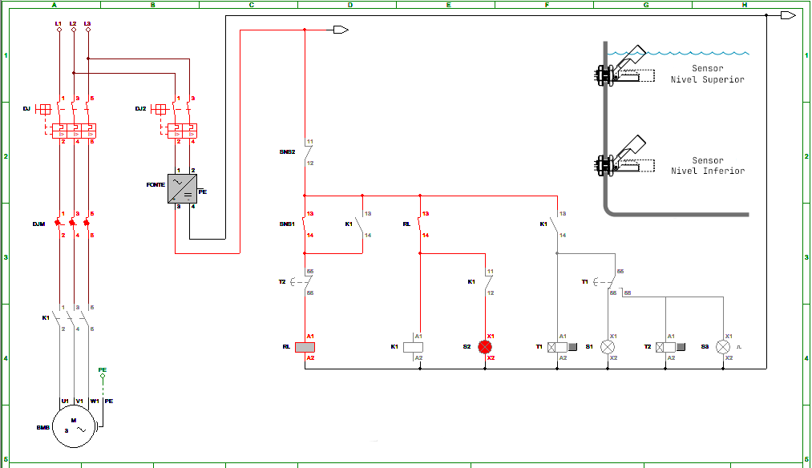

# Simulação de Reservatório - Projeto em Java

Este projeto simula o controle de um reservatório de água utilizando Java, focando em componentes elétricos e lógica de automação.

## Componentes
### Sensores
* Sensor Superior: Indica o nível superior de água no reservatório. Contato aberto quando o nível é alcançado.

* Sensor Inferior: Indica o nível inferior de água no reservatório. Contato fechado quando o nível mínimo é atingido.

### Dispositivos de Controle

* Relé de Interface: Controla a ativação da bomba com base nos sinais dos sensores.

* Bomba: Responsável pelo bombeamento da água para o reservatório.

### Sinais Luminosos

* Sinaleiro Verde: Indica que a bomba está em funcionamento e o reservatório está sendo abastecido.

* Sinaleiro Amarelo: Sinaliza um problema no sensor superior, ativando um temporizador. Após o tempo estabelecido, a bomba é desligada.

* Sinaleiro Vermelho: Indica falha no motor da bomba, impedindo o início do processo de abastecimento.

### Funcionalidades
O projeto implementa as seguintes funcionalidades:

* Monitoramento dos Sensores: Verifica continuamente os estados dos sensores superior e inferior.

* Controle da Bomba: Ativa a bomba quando o sensor inferior detecta nível baixo de água e desliga quando o sensor superior indica nível adequado.

* Gestão de Falhas: Sinaliza problemas através dos sinaleiros e registra eventos no log.

* Temporizador: Entra em ação caso haja falha no sensor superior, garantindo que a bomba seja desligada após um intervalo específico.

## DIAGRAMAS - POTÊNCIA / COMANDOS

### FUNCIONAMENTO - OK!

    INFO: OK: Sensor_Inferior: true, Rele_Interface: true
    INFO: Sinal de OK enviado.
    INFO: Sinaleiro verde acionado.
    INFO: Abastecendo...
    INFO: Sensor superior acionado. Motor desligados.
    INFO: Abastecimento concluido.
---

### FALHA NO SENSOR_SUPERIOR:

 
    INFO: OK: Sensor_Inferior: true, Rele_Interface: true
    INFO: Sinal de OK enviado.
    INFO: Sinaleiro verde acionado.
    INFO: Abastecendo...
    WARNING: Temporizador acionado.
    WARNING: Sinaleiro amarelo acionado.
    INFO: Abastecimento concluido.
    WARNING: Falha no sensor superior.
---

### FALHA NO MOTOR:

  
    INFO: OK: Sensor_Inferior: true, Rele_Interface: true
    INFO: Sinal de OK enviado.
    WARNING: Sinaleiro vermelho acionado.
    WARNING: Falha no motor.
  